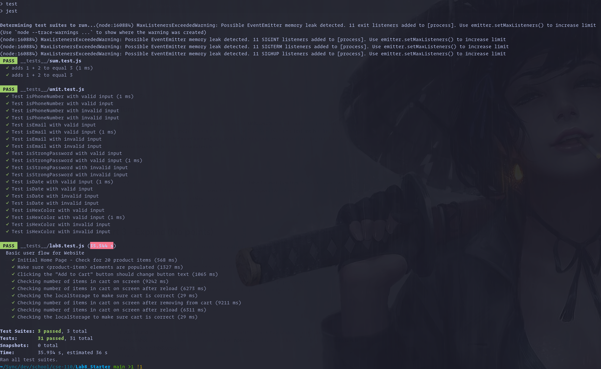

# Lab 8 - Starter

Solo submission

1) Where would you fit your automated tests in your Recipe project development
pipeline? Select one of the following and explain why.

> For the key term "automated tests", I would fit it in the "Build" stage of the
> development pipeline. The reason is that the "Build" stage is where the
> project is compiled and tested. The "Build" stage is also where the project is
> packaged and deployed. So, if any tests fail, the project will not be
> packaged and deployed. But of course, it makes sense to run the tests manually
> before pushing the code to the repository.

2) Would you use an end to end test to check if a function is returning the
correct output? (yes/no)

> No, I would not use an end to end test to check if a function is returning the
> correct output. The reason is that an end to end test is a test that tests the
> entire application from start to finish. So, it would not make sense to use an
> end to end test to test a single function. It's a job for the unit tests.

3) Would you use a unit test to test the "message" feature of a messaging
application? Why or why not? For this question, assume the "message" feature
allows a user to write and send a message to another user.

> No. Because the "message" feature is a feature that involves multiple parts of
> the application. It involves the user interface, the database, and the
> backend. So, it would not make sense to use a unit test to test the "message"
> feature. It's a job for the end to end tests.

4) Would you use a unit test to test the "max message length" feature of
a messaging application? Why or why not? For this question, assume the “max
message length” feature prevents the user from typing more than 80 characters.

> Yes. Because this constraint is simple a function (or part of a function) that
> can be isolated and unit tested. If the input string is longer than 80
> characters, then the function will simply return a boolean value of false,
> which is simple to test.

